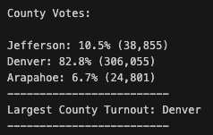
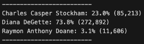

# ELection Audit

*Prepared for Seth and Tom - 2021 JAN 17*

## Overview of Election Audit

### Purpose

The main purpose of this audit is to analyse the election results and submit the data findings to the election commission. This audit will inlcude the following data:

* Total number of votes cast
* Voter turnout and percentage of votes from each county, including the county with the highest turnout
* A complete list of candidates who received votes
* Total number of votes and the percentage of votes each candidate received and won, respectively
* The winner of the election (based on popular vote)

### Resources

* Data source: election_results.csv
* Software: Python 3.8.5, Visual Studio Code, 1.52.1

## Election Audit Results

* The total number of votes casted in this congressional election were **369,711**
* The number of votes and percentage of total votes for each county in the precinct is as follows:
!
* The following depicts a breakdown of the number of votes and precentage of total votes each candidate receieved:
!
* **Diana DeGette** was the winner of this election, and the following image presents the total number of votes won as well as the overall percentage of votes recieved, thus securing the popular vote
!

## Election Audit Summary

### Advantages & Disadvantages

Smoother programming, debugging, and code base that is easier to maintain are all advantages of refactoring code. The typical clear and concise outcome of refactored code promotes easy readability. That being said, when in the process of refactoring code, one may introduce bugs when refactored incorrectly.

### Pros & Cons 

Specifically to this particular dataset, refactoring has a practical application to the orginal VBA script as it enables thousands of stocks to be analyzed at one time. 
